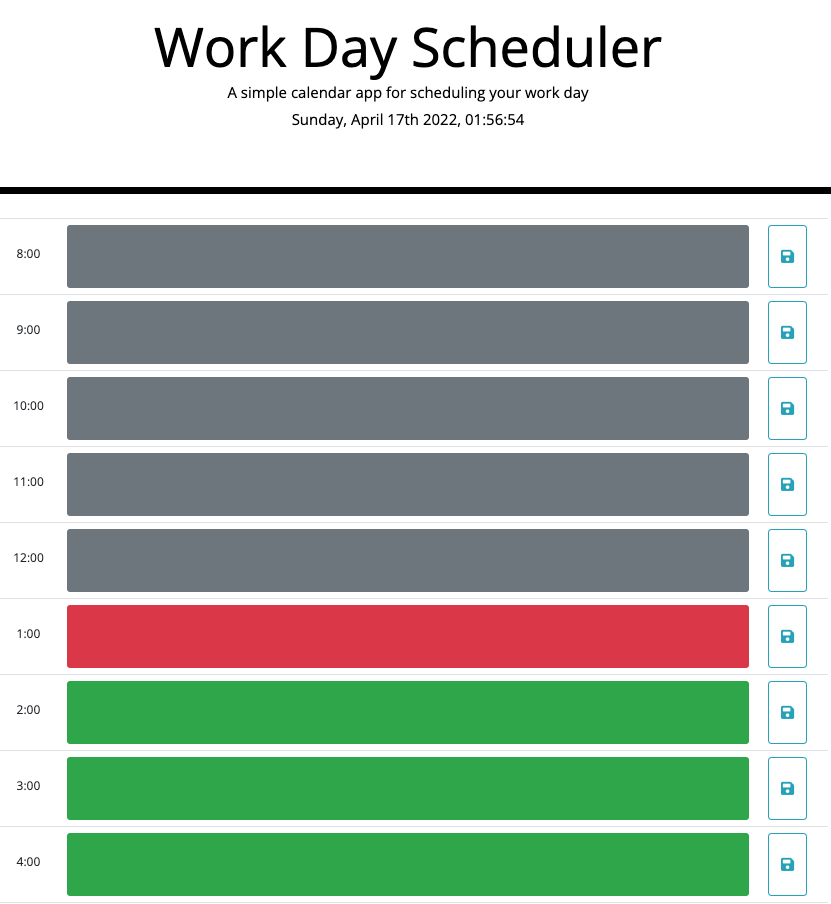

# Office Task Planner
Office Task Planner is a webpage that lists every hour of the day (8am-7pm) as a new row. Inside of each row, you can write down some task that you wish to accomplish within that given hour.

## Technologies Used
HTML  
CSS/Bootstrap  
JavaScript  
JQuery  
Moment.js

[Click here to view the deployed page!](https://allenm03.github.io/office-task-planner-/)

## Contributions
[Allen McBroom Bey](https://github.com/AllenM03)
